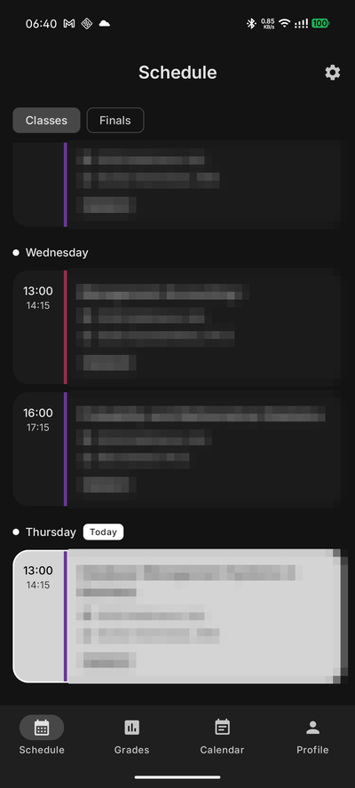
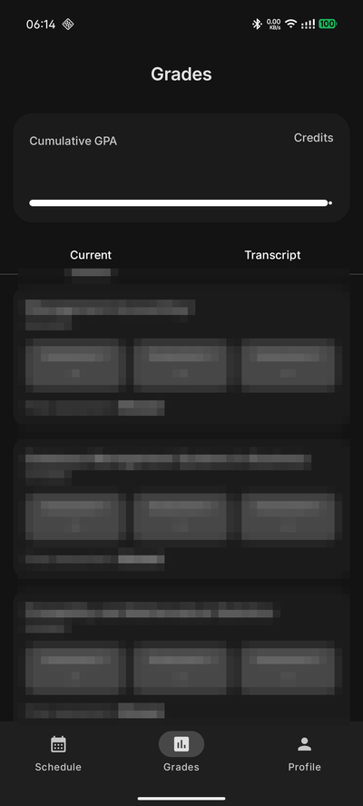
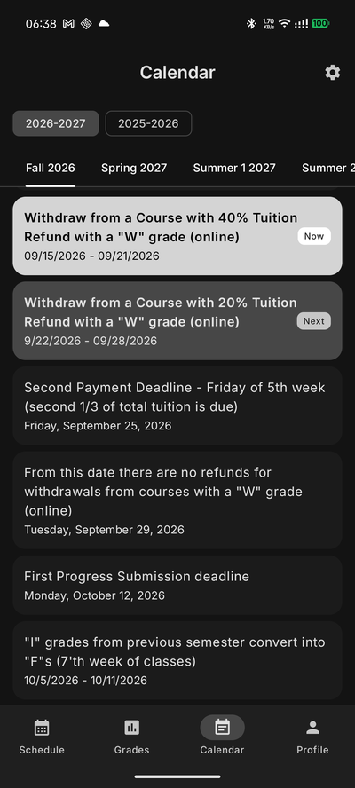
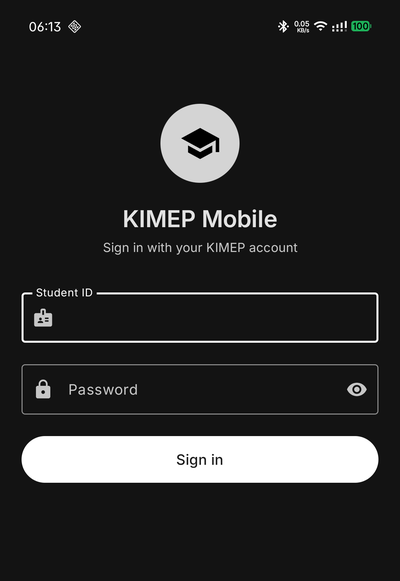
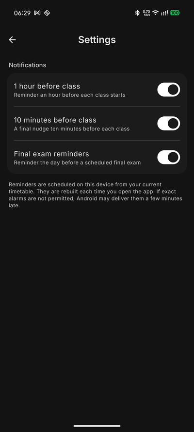
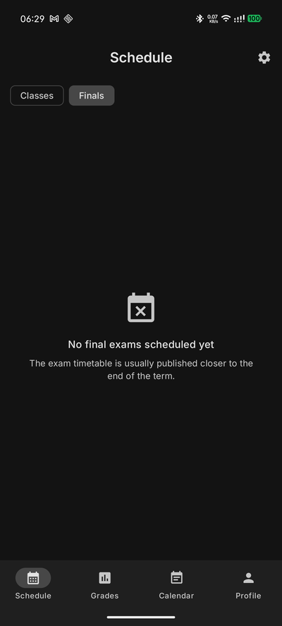

# KIMEP Mobile — unofficial Android client

An unofficial Android client for **KIMEP University**'s student portal, built after
reverse‑engineering the deprecated iOS app (`kz.kimep.kimepmobile`) that was removed from
the App Store but whose backend is still live.

It talks to the same `/ext/mobile` API and reproduces the useful parts — schedule, grades
and the academic calendar — with a native Material 3 interface, offline caching and class
reminders.

[](https://github.com/artchsh/kimep-reverse/releases/latest)
[](https://github.com/artchsh/kimep-reverse/actions/workflows/android.yml)

**➡️ [Download the latest APK](https://github.com/artchsh/kimep-reverse/releases/latest)**

<p align="center">
  
  &nbsp;
  
  &nbsp;
  
</p>
<p align="center">
  
  &nbsp;
  
  &nbsp;
  
</p>

## Features

- **Login** with your Student ID and password; the session is stored on device and
  refreshed automatically.
- **Schedule** — weekly timetable grouped by weekday, with the **current day highlighted**,
  a **midterm‑week banner** derived from the academic calendar, and pull‑to‑refresh.
  Cached locally so it renders instantly on launch and updates in the background.
- **Finals** — a Classes/Finals switch for the exam timetable (populated once KIMEP
  publishes it).
- **Grades** — cumulative GPA and credits, current‑term assessment scores, and the full
  transcript grouped by semester with colour‑coded grade badges.
- **Academic calendar** — the official PDF parsed into structured data: browse both
  academic years and all semesters, with the ongoing event marked **Now**, the next one
  **Next**, and past events dimmed. Opens scrolled to the current event.
- **Reminders** — notifications **1 hour** and **10 minutes** before each class, plus a
  final‑exam reminder. Each is individually togglable.
- **Material You** dynamic colour, light/dark theme, edge‑to‑edge.

## Tech stack

Kotlin · Jetpack Compose · Material 3 · Ktor (OkHttp engine) · kotlinx.serialization ·
DataStore · AlarmManager · Coil. AGP 9 with built‑in Kotlin, `minSdk 26`, `targetSdk 37`.

## Repository layout

```
kimep-android/          Android app (Gradle project)
  app/src/main/java/kz/kimep/mobile/
    data/               models, API client, repositories, caches, notifications
    ui/                 Compose screens + theme
    vm/                 view models
  app/src/main/assets/calendar.json   parsed academic calendar
docs/
  KIMEP_Mobile_API.md   reverse-engineered API reference
  CAPTURE_SETUP.md      how the API was captured from a stock iPhone
tools/
  parse_calendar.py     KIMEP calendar PDF -> calendar.json
capture.py              mitmproxy addon used during reverse engineering
dnsmasq.conf            DNS redirect used for the reverse-proxy phase
```

## Building

```bash
cd kimep-android
./gradlew :app:assembleDebug        # debug APK
./gradlew :app:assembleRelease      # release APK
```

Requires JDK 17+ and an Android SDK with API 37 (`local.properties` → `sdk.dir`).

Release builds are signed from `kimep-android/keystore.properties` (git‑ignored):

```properties
storeFile=keystore/kimep-release.jks
storePassword=…
keyAlias=…
keyPassword=…
```

If that file is missing, the release build falls back to the debug signing config so a
fresh clone still compiles.

## How the API was reverse engineered

The iOS app was captured on a stock (non‑jailbroken) iPhone: mitmproxy for the proxy
phase, then a **DNS redirect + reverse proxy** once the Flutter client turned out to
ignore the iOS system proxy. The full, reproducible procedure — including the pitfalls
and teardown — is in **[docs/CAPTURE_SETUP.md](docs/CAPTURE_SETUP.md)**.

The resulting endpoint reference is in **[docs/KIMEP_Mobile_API.md](docs/KIMEP_Mobile_API.md)**.

## Academic calendar pipeline

KIMEP publishes the calendar as PDFs (KAZ/RUS/ENG). `tools/parse_calendar.py` downloads the
English ones and reconstructs the four‑column table from word coordinates
(`pdftotext -bbox`), emitting `calendar.json` that ships as an app asset. Re‑run it each
academic year:

```bash
python3 tools/parse_calendar.py     # needs poppler (pdftotext)
```

## Disclaimer

Unofficial and not affiliated with KIMEP University. Personal educational project that
uses the university's own public endpoints. No credentials or captured personal data are
committed to this repository.
